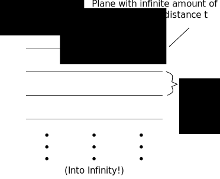
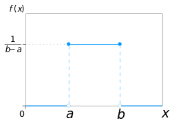
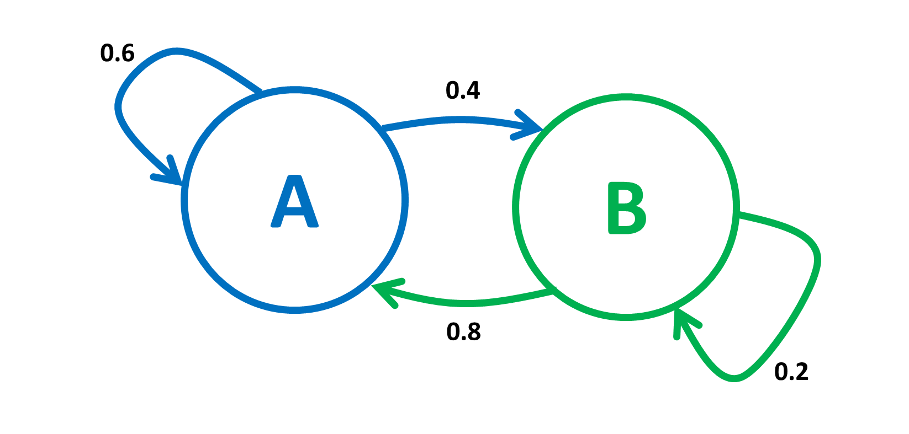

Summary of Lecture notes on Monte Carlo simulations
# Ch 1. - Introduction
- Emphasis on Markov chain Monte Carlo and Critical phenomenas.
- The term Monte Carlo is used in the broad sense to contain all kinds of calculations that can be perfomed with the help of random numbers
- It's interesting how necessary true random values are in these simulations in order to get workable values
## Buffon's Needle, an example of a random simulation
Imagine you have have a plane of an infinite amount of parallel lines spaced out with the distance t. Also imagine you have a needle that is t long. If this is the case, you could throw the needle onto the plane and the probability that the needle will cross a line is equal to $\frac{1}{\pi}\int_{0}^{\pi}sin(\theta)d\theta=\frac{2}{\pi}$. Then throwing the needle multiple times you could from the amount of times it crosses the line calculate $\pi$.

This creates a way to calculate $\pi$ via a computer simulation, if we can generate proper random sequences. This is basically what this course is about, looking at simulations that relies on randomness for its accuracies, when these simulations breaks down and what happens then.

## Simplified, focused, models
In this course the focus is on simplified, universal simulations and cases. These could later be extended to more complex cases, but in generally its better to focus on one problem at a time and then put everything together.

## The different kinds of Monte Carlo simulations
In this course 3 kinds of Monte Carlo simulations are considered.
- __Transport simulations__. For instance if a stream of neutrons get shot into a sheild, how many will get through? Here we could randomize the result in every atom collision and come up with an estimation
- __Markov Chain Monte Carlo__. Useful in statistical physics where configurations appear with a probability propotional to the Boltzmann factor.
- __Simple Stochastic Models__. Should not be called Monte Carlo, but is in this course non the less.

# Ch 2. - Random variables and distributions
- $p(x)$ - Probablity density function
- $\int p(x) dx=1$ Always! Or if x is descrete $\sum_{i}p(x^{(i)})$ (Part of the def. of p.d.f.)
## Structure of Ch2
We define mean and variance, which we use to characterize various distributions. We then calculate these for different distributions and combinations of them. We then go over to estimate this. The mean is usually easy to estimate, the variance is harder. Thus more focus on variance.

Then we will look at generating random samlpes from various simple distributions.

Lastly we will look at Markov chains.

## Building Distrubition, means and variance
Mean ($\mu$) def.
$$\mu=\int x p(x) dx$$
Varians (${\sigma}^2$)
$${\sigma}^2=\int (x-\mu)^2 p(x) dx$$

###  Mean and variance of combinated variates
Imagine that $Z$ is made up of 2 indepndet distrubutions $X$ and $Y$, then:

Mean
$$\mu_z = \mu_x + \mu_y$$
Variance
$$\sigma^{2}_z = \sigma^{2}_x + \sigma^{2}_y  $$

Thus imagin if M var a random distribution built of like
$$M=\frac{1}{N} \sum^{N}_{i=1}X_i$$
then the variance of m must be
$$\sigma^2_m= \frac{1}{N} \sigma^2_x$$

### Correlation and Variance of Correlated Varibles
Covariance is defined as
$$cov[x,y]=\int (x-\mu_x)(y-\mu_y)p(x,y)dxdy$$
then the variance of $Z$ built by by $X$ and $Y$
$$\sigma^{2}_z = \sigma^{2}_x + \sigma^{2}_y  + 2cov[X,Y]$$
The correlation coefficient is a normalized value for the amount the function correlate
$$\rho \frac{cov[X,Y]}{\sqrt{\sigma^2_x\sigma^2_y}}$$

### Distribution of a sequence of distributions
$X_1,...,X_n$ is a sequence of corelated ditributions where each distribution is described by $\mu$ and $\sigma^2$ and the correlation are $cov[X_i,X_j] = \langle X_i X_j \rangle -\mu^2$ and we build a distribution as
$$M=\frac{1}{N} \sum^{N}_{i=1}X_i$$
Then
$$\sigma^2_m = \frac{1}{N} \left\{ \sigma^2 + 2 \sum^{N-1}_{j=1} p^{'}_j \right\}$$
where
$$p^{'}_j = \frac{N-j}{N} cov[X_i,X_{i+j}] $$
We can also thing of the funn unnormalized correlation coefficient as
$$p^{'} =  \sum^{N-1}_{j=1} p^{'}_j$$

If we add in the definition of correlation time $\tau = \frac{p'}{\sigma^2}$ And put $N'= \frac{N}{1 +  \frac{2p'}{\sigma^2}}$ we can rewrite the expression for the variance of $M$ as
$$\sigma^2_m = \frac{\sigma^2}{N'}$$

WHY DO WE DO THIS!? CHANGE THIS!!!

## Discrete Distributions to Note
### Binomial Distribution
The binomial distribution is when you have two mutually exclusive cases, $x=0$ and $x=1$. The chance for one event is $\alpha$. Then a probabilty densitiy function could look like this
$$
\rho(x) =
\begin{cases}
1-\alpha, &\text{if } x=0 \\
\alpha, &\text{if } x=1
\end{cases}
$$
Or
$$
\rho(x) = \alpha^x (1-\alpha)^{(1-x)}
$$
Which yeild the mean
$\mu = \alpha$ and variance $\sigma^2 = \sigma (1-\sigma)$

To figure out out how many success ($x=1$) one should have out of $N$ attempts, one can build this function through the binomial distribution
$$
P_N(n) = \frac{N!}{n!(N-n)!}\alpha^n(1-\alpha)^{(N-n)}, \text{ } 0\le n \le N
$$
### Poisson Distribution
Imagine a process that depends on a number of independent events. If the average time between two successive events is $\tau$ then the averge number of such events during a time $t$ is $\mu = \frac{t}{\tau}$. So the probability that n events has taken place in $t$ amount of time is given by the Poission distributions pdf
\[
p(n)=\frac{\mu^{n}}{n!}e^{-\mu}
\]
Note that due to the power series $\sum_n \frac{\mu^{n}}{n!} = e^{\mu}$ the pdf is normalized (i.e. $\sum_np(n) = 1$).
The variance is $\sigma^2=\mu$

## Continuous Distributions to Note
### Uniform Distribution
For the uniform distribution the pdf is constant for a certain interval $a$ to $b$.
\[
p(x)= \frac{1}{b-a}, a \le x \le b
\]

Mean: $\mu = (b+a)/2$.

Variance: $\sigma^2 = \frac{(b-a)^2}{12}$

If $a=0$ and $b=1$ the random variable will be called $\xi$

### Gaussian Distribution
The bellshaped pdf. Complete with the mean and variance in the formula. Very important
\[
p(x) = \frac{1}{\sigma \sqrt{2\pi}}\exp{(-\frac{(x-\mu)^2}{2\sigma^2})}
\]

If one build a random variable $M$ as
\[
 M = 1/N \sum_{i=1}^N X_i
\]
It turns out no matter what distribution variates the $X_i$:s has it will to a good proximation yeild a gaussian distributed $M$ with the variance $\sigma^2_x/N$. The only requirements are that $\sigma^2_x$ is finite and the $N$ is not to small. Usually $N\le10$ is enough. This is the Central Limit Theorem.

### Exponential Distribution
The time interval between successive random events (See the relationship with poissson, here it's time between events, poisson is number of events given a certain time) follow an exponential distribution.
\[
p(x)=\frac{1}{\mu}e^{(-\frac{x}{\mu})}, x \le 0
\]
Mean: Given in pdf
Variance: $\sigma^2=\mu^2$
### Power Law distribution
pdf:
\[
p(x)=C_0x^{-\gamma}
\]
Where
\[
C_0 = (\gamma-1)x_0^{(\gamma-1)}
\]
Only definded for $x \ge x_0$ with $x_0>0$ and only possible to normalize for $\gamma > 1$ the mean is only definded for $\gamma>2$ and the variance only for $\gamma >3$.

## Estimation
Now make analyses of finite number of samples. Thus we we only estimate means and variances. These values will be represented as
- Estimated Mean: $m$
- Estimated Variance: $s^2$
### Mean and variance
With N observerblas $x_i$ the estimate of the mean is
\[
m=\frac{1}{N} \sum_i(x_i)
\]
The estimated variance is (with the estimated mean)
\[
 s^2 = \frac{1}{N-1}\sum_i (x_i - m)^2
\]
But for simulations one often has the values $\sum_i x_i$ and $\sum_i x_i^2$ so a useful rewrite of the estimated variance is
\[
 s^2 = \frac{1}{N-1}(\sum x_i^2 - \frac{1}{N} (\sum x_i)^2)
\]
### Estimation with Correlated variates
From a simulation you ofter get sequences fo values $x_1,x_2,...$ which are from a dstribution characterized by $\mu$, $\sigma^2$ and some $cov[x_i,x_{i+j}]$. Mean is the same even though the covariance. The istemation of the variance is is changed though.
\[
s^2 = \frac{1}{N-1}(\sigma^2+2r^{(J)})
\]
where
\[
r^{(J)} = \sum^J_{j=1} r_j
\]
and $r_j$ is
\[
 r_j = \frac{1}{N-j} \sum^{N-j}_{i=1} (x_i - m)(x_{i+j} - m)
\]
But where did this j come from? Basically $r_j$ is the correlation factor in the variance estimate. If the correlation time is much smaller then $N$, so that the sequenced values get uncorrelated fast... Then the $r$ factor will become pure noise after a while when iterating through the sequenced values. We then instead choose a J which make is taken so that we get measureble correlation.

For instance maybe only the the closest 3 values in a sequence is correlated, we then pick $J=3$

## Error Estimates
Imagine that we are interested in the average of a certain quantity A, this average is written as $\langle A \rangle$. If we then want to now what certainty we actually got this average with we need the variance $\sigma_A$ in order to figure out this certainty. Assuming that this average are from a Gaussian, normal, distribution (which it should be under the Central Limit Theorem) then the likelihood that our average is within $\pm \sigma_A$, $\pm 2\sigma_A$, $\pm 3\sigma_A$ is
\[
 P(|\langle A \rangle-\mu_A|<\sigma_A) \approx \text{68%}
\]
\[
 P(|\langle A \rangle-\mu_A|<2\sigma_A) \approx \text{95%}
\]
\[
 P(|\langle A \rangle-\mu_A|<3\sigma_A) \approx \text{99.7%}
\]
So this section is all about finding $\sigma_A$
### Independent Data
Look in book, author seems to be high. Basically get the estimated variance as usual. Some interesting rewrites of formulas might exists here for lab or problems.
### Correlated Data
Look in book, author seems to be high. Basically get the estimated variance as usual. Some interesting rewrites of formulas might exists here for lab or problems.
### Blocking Method
In long simulations it's not unusual to group $N$ measurments togother into $N_B$ groups with $N_S$ samples each. We colud then choose to keep the blocks so big that the correlation between the blocks are negliglble (i.e. $N_S >> \tau$). Thus we can use the simple variance estimate using the number of blocks and the average of the blocks.
### Bootstrap Method
Basic idea is to resample your sampled data. Get a better variance but same mean.

Get a sample size of size $n$. Then take values from the sample size randomly $n$ times without memory (i.e. you could measure the same sample several times). Then take an estimated mean $m_k$. After doing this $N_k$ times you could get an estimated variance of the mean of the actual sample size of $n$ samples to be
\[
 s^2 = \frac{N_k}{N_k-1} (\langle m^2_k \rangle - \langle m_k \rangle^2)
\]  

## Sampling a Distribution with Markov Chains
### Markov Chain
Imagine a situation where you can enter a state $A$ and a state $B$. And depending on which state you are in you have a certain chance to get into either state $A$ or state $B$ when you do a transition. In this example if you are in state $A$ you have a 60 percent chance to enter state $A$ again and a 40 percent chance to enter state $B$ in a state transition. If you are in state $B$ you have a 20 percent chance to enter state $B$ again and a 80 percent chance to enter state $A$ in a state transition.

This system give birth to two questions.
 1. If I start in a certain state what's the probability that i am in a certain state after $n$ amounts of transitions?
 2. We can also ask our self if, after a large amount of state transitions, the percentages to be in a certain state converge?

A good way to solve these questions is to turn too the often useful matrix representations and the Eigen math that comes with it.

Lets represent the state, or probability for a state as a vector, $\pi$, representing $A$ and $B$ respectively
\[
\begin{bmatrix}
A_{probability} & B_{probability}
\end{bmatrix}
\]
Lets then represent the probability for a certain transition as a matrix we call the transition matrix, $\overline{T}$. Where the first row represents the probability of transitions from $A$ to another state and the second row represents the probability of transitions of $B$ to another state.
\[
\begin{bmatrix}
\text{A->A probability} & \text{A->B Probability} \\
\text{B->A probability} & \text{B->B Probability}
\end{bmatrix}
\]
Note how the rows must sum up to 1 (mathy way to represent 100%... But if this is not clear for you this math might be a bit above your head, but  encourage you to google it anyway and try your best), in order to represent a certain state transition, something we defined must happen at a state transition.

So for our example, if we start at state A we would get the probability to be in either state $A$ or $B$ by multiplying the current state (With a $1$ for state $A$ and $0$ for state $B$ since we are with a 100% probability in state $A$) with the state transition matrix as
\[
\begin{bmatrix}
1 & 0
\end{bmatrix}
\begin{bmatrix}
0.6 & 0.4 \\
0.8 & 0.2
\end{bmatrix}
=
\begin{bmatrix}
0.6 & 0.4
\end{bmatrix}
\]
This is something we trivially could have figured out by looking at the A circle in the first picture/diagram. But now we can move on to look at the questions asked earlier. To start with lets ask what happens with the probability to be in what state after $n$ state transitions. Lets make it easy and put $n=2$. Well we know now that if we start in state $A$ and do one transition, we have a certain probability to be in either state $A$ or state $B$, lets use that probability as our state and do another transition
\[
\begin{bmatrix}
0.6 & 0.4
\end{bmatrix}
\begin{bmatrix}
0.6 & 0.4 \\
0.8 & 0.2
\end{bmatrix}
=
\begin{bmatrix}
0.68 & 0.32
\end{bmatrix}
\]
which gives the probability to be in stat $A$ after two state transition to be 68 percent and 32 percent probability to be in stat $B$. If we want to increase $n$ we just carry on these operations until we done it $n$ times.

But to move on to the other question if the system will reach any equilibrium? That after a certain time it doesn't matter where we started, the system will find a balance where there always is a certain percent to find in state $A$ or state $B$ no matter how high $n$ after $n$ has gotten very large. Lets say $n \le n_0$ where $n_0$ in the usual cryptical way is just an arbitrary number which we wont analyze right now and is highly depended on every case. Anyhow, to reach such a state we want to find a probability to be in a certain state which wont change if we multiply it with the transition matrix. Woop! Eigen value problem! Fun stuff... We wanna find the eigenvector with the eigenvalue 1. So lets do it! (note that this is not always possible, nor something that only has one solution depending on the amount of dependencies... But you know your eigenvalues and vectors so fuck me for being condescending).

Basically, if we call the eigenvector $\pi$ and the transition matrix $\overline{T}$, we want to solve the equation
\[
\pi \overline{T} = \pi
\]
which is the same as solving ($I$ is the identity matrix)
\[
 \pi (\overline{T} -I) = 0
\]
Which reduces, in our running example, to the equation system ( a little confusing since we're using a rather awkard order with the vector before the matrix to follow with the book (yes this is a summary for a book))
\[
\begin{matrix}
 -0.4A+0.8B = 0 \\
 0.4A-0.8B = 0
 \end{matrix}
\]
Which gives us the eigenvector
\[
\begin{bmatrix}
A=2 & B=1
\end{bmatrix}
\]
But in order for the eigenvector to represent probability the sum of the elements has to be 1! So solve for that! (tip: divide with $c = 2+1 = 3$)
\[
 \pi =
 \begin{bmatrix}
 2/3 & 1/3
 \end{bmatrix}
\]
And there we have it. No matter what we state we start in... After a certain amount of state transitions we will with about 66 percent probability be in state $A$ and with 33 percent probability in state $B$.

Looking back at this example we can also see that maybe we can not just occupy one state, but several number of state can be occupied at the same time. For instance lets say we have small town with 100 people. In this fictional town we also only have two ways to eat dinner, either at home or at the popular Mexican restaurant which somehow seems to be able to earn enough money to keep it doors open in a town with only a 100 people. Lets say that eating at home is state $A$ for every person in the town, and eating at the Mexican is state $B$. Then we could say that every dinner we have 66.6 people eating at home and 33.3 people at the Mexican restaurant.

We could almost go as far as calling $\pi$ for a state itself though, although that could be slightly misleading. This eigenvector of the transition matrix is also sometimes called the probability distribution of the system. Something that is done in the summarized book. This can be defended as to this actually becomes the pdf when we reached the steady state, so it's not completely dumb.
### Construct the Transition Matrix
So lets say we have the $\pi$ or pdf we want to have a transition matrix to. How do we construct a transition matrix? Well the book doesn't really wanna tell us that even though the title of the section misleads us to belive that (fuck sakes... Fuck fuck fuck, this is an R-rated text you know).

But we do go through detailed balance which can be shown to be a requirement on a transition matrix that ensures its valid. This detailed balance is
\[
 \pi_i p_{ij} = p_j p_{ji}
\]
And holds because if it holds then we can rewrite $\sum_i \pi_i p_{ij}$ as $\pi_j \sum_i p_{ji}$ which is equal to $\pi_j$. Thus we prove that all $\pi_i$:s (rembember the summation sign) together has probability to enter state $\pi_j$ that is equal to $\pi_j$ (i know... confusing)

Basically what gets confusing is that we refer to $\pi_j$ as a state as in a circle we can occupy AND the probability to just be in $\pi_j$ after any given transition, not really paying attention to previous states you had.  Just make sure to keep an eye out for that.

One other thing that is done, is splitting up the probability into two parts, the probability for a transition to be suggested and the probability for a transition to be accepted. This is utter nonsense in its context. This _will_ be used later in the book, but as for right now it really don't hold any merit and as you google on it seems it's only the author who likes doing it this way right now. Anyhow, since it will be usable in a lab later lets talk about splitting $p_{ij}$
\[
p_{ij} = q_{ij}\alpha_{ij}
\]
Where $q_{ij}$ is the probability for transition to be suggested and $\alpha_{ij}$ is the probability for acceptance.
Using this construction the detailed balance can be enforced through
\[
\alpha_{ij} = min(1, \frac{\pi_j q_{ji}}{\pi_i q_{ij}})
\]

According to the book one often wants a symmetric targeting probability so $q_{ij} = q_{ji}$ then the detailed balance becomes
\[
\alpha_{ij} = min(1, \frac{\pi_j}{\pi_i})
\]
this is called the metropolis algorithm.
### Correlations
Imagine A is a certain state of sorts. So A(t) is the measured value of A at a time t (people at Mexican restaurant anyone?) and $\langle A \rangle$ is the mean value or solved for value
\[
\delta A(t) = A(t) - \langle A \rangle
\]
then the time correlation function for the quantity $A$ is
\[
C_A(t) = \langle \delta A(t') \delta A(t'+t) \rangle
\]
I assume $t'$ is small? Like at most a few state transitions? Why this is the case i don't know... it's just a gut feeling :S

This correlation also kinda decays exponentially... Some slightly jumpy and confusing math in the book we get showned that
\[
 C_A(t) \approx e^{-t/\tau}
\]
for sufficently large $t$

#Ch. 3 - The Lennard-Jones gas
We want to do Monte Carlo simulation of a classical gas.

First the different ensembles are reviewed. Then we look at the equations and interpret them as something that depends on the different free energies as Legendre transformation of the _entropy_. We then do a short comparison of molecular dynamics and Monte Carlo simulations.

After this we move on to look at the steps necessary to go from the quantum formulation of statistical mechanics to a classical formulation where each microscopic state is defined through the positions and the momentum of all the particles. In that section we laso give the simple recipe for a Monte Carlo simulation in a gas of interacting particles.

We then go on and look at the additional steps required to include volume fluctuations, which are needed in simulations with constant pressure. Lastly we look at the steps required to deal with creation and annihilation of particles, something that is needed for the Grand Canonical ensemble.

## Summary of the different ensembles
### Microcanonical ensemble
__Clarification:__ In the microcanonical ensemble we look at the entropy of the system as a function of the volume, energy and number of particles.

The basic behind equilibrium statistical physics is that all states with the same energy are equally likely to show up. Lets imagine a sytem wehere we can control the entropy, $S$, the volume, $V$, and the number of particles, $N$. This system would me describide by the internal energy
\[
E(S,V,N)
\]
We then submit that infinitesimal changes of the control variables change $E$ as following (\mu reprents the chemical potential)
\[
dE = TdS - pdV + \mu dN
\]
And according to the book, and statistical physics, (we don't present the proof here) the system can be described through entropy as
\[
S(E,V,N) = k_B ln\Omega(E,V,N)
\]
where $\omega$ is the amount of states with a certain energy described as follows (Note that $\delta$ is the delta function which evaluate to $1$ only when $x=0$, otherwise zero, and $v$ is the amount of state that exists)
\[
\Omega(E,V,N) = \sum_v \delta(E - E_v)
\]

### Canonical ensemble
__Clarification:__ In the canonical ensamble we look at a system as a function of temperature, volume and number of particles. The entropy might then fluctuate. The resulting function we look at then is the Helmholtz free energy

Helmholtz free energy, $F$, is described as (through something called a Legendre transformation)
\[
 F(T,V,N) = E(S,V,N) - TS
\]
The differential is
\[
 dF = -SdT - pdV + \mu dN
\]
The probability of a configuration to show up is proportional to the Boltzmann factor, $e^{-\beta E_v}$, where $\beta  = 1/(k_B T)$.

We have a basic quantity in statistical physics we call the partition function. This is built up of a sum of Boltzmann factors. This can be taken as something that comes up again and again, and therfore interesting. This partition is defined as
\[
Z(T,V,N) = \sum_v e^{-\beta E_v}
\]
And we can use this to defined the Helmholtz free energy as (just take it at face value)
\[
 F(T,V,N) = -k_BT\ln{Z(T,V,N)}
\]
The expectation value of an observable can now be written as
\[
\langle A \rangle = \sum_v P_v A_v = \frac{1}{Z} \sum_v A_v e^{-\beta E_v}
\]
And especially for the energy using the partition function and the differentials we defined so far
\[
\langle E \rangle = \frac{1}{Z} \sum_v E_v e^{-\beta E_v} = - \frac{1}{Z} \frac{\partial Z}{\partial \beta} = - \frac{\partial ln Z}{\partial \beta}
\]
And the heat capacatiy can be determined from the fluctuations in the energy (this is only needed to be given)
\[
C = \frac{\partial \langle E \rangle}{\partial T} = \frac{1}{k_B T^2} ( \langle E^2 \rangle - \langle E \rangle^2)
\]
### Constant pressure ensamble
Well what if we want to set the temperaturel pressure and number of particles fixed? Well the constant pressure ensemble to your rescue! Using a transform we magically used earlier (Legendres) we can create a new ensemble
\[
G(T,p,N) = F(T,V,N) + pV
\]
With the differential
\[
dG = -SdT + V dp + \mu dN
\]
the generalization of the partition function in this case becomes
\[
\Phi(T,p,N) = \sum_V e^{-\beta pV}Z(T,V,N)
\]
and we get
\[
G= -k_B T \ln{\Phi}
\]
### Grand canonical ensemble
Here we have the temperature, volume, chemical potential set. So through transformations we get the ensemble
\[
F_G(T,V,\mu) = F(T,V,N) + \mu N
\]
With the differential
\[
dF_G = -SdT - pdV + Nd\mu
\]
and
\[
F_G = k_B T \ln{\Xi}
\]
where
\[
\Xi (T,V,\mu) = \sum_N e^{\beta \mu N} Z(T,V,N)
\]

## Gibbs entropy formulation
The seemingly only interesting forumla in this section is for the microcanonical ensembles entropy where we derive
\[
S(E,N,V) = k_B \ln{\Omega}
\]
## Monte Carlo versus Molecular Dynamics
In molecular dynamics we look at the position of particles and its velocity to simulate the gas
\[
\dot{\mathbf{r}}_i = \mathbf{v}_i
\]
\[
m\dot{\mathbf{v}}_i = \sum_{j \ne i} \mathbf{F}_{ij}
\]
And for these molecular dynamics one start with specifiyng the the energy $E = m \langle v^2 \rangle /2$, the volume and the number of particles. Then through intergrations from forces one calculate positions and then calculate again for each timestep. This is interesting if one want to see how the gas evolves over time, but if the goal is only to see the steady state, the state the whole gas will eventually reach stably, then Markov chain is equally good. Infact from a simualtion perspective is allot simpler to execute, thus creates a faster simulation that can, for instance, deal with much larger systems.

In markov chain simulations of a classical gas, one only take into consideration the position of the particles. Then for every state transition there is a probability for a new state to be given for each particle and a certain probability for it to be accepted (Why this is so is not clearly explained yet, why cant there just be one probability?). Thus it's completely stochastic. One also typically use the canonical ensemble and set the temperature and let the energy in the system fluctuate instead.(Why this is simpler is probably due to some math thing, but yet again not properly argued for in the textbook).
## Classical statistical mechanics
Here we basically look at the partition funcion for the canonical ensamble
\[
Z(T,V,N) = \sum_v e^{-\beta E_v}
\]
Then go on to say that we look at the gas in a quantum way, so ceah microscopic state is then a point in what we call a phase space $(\mathbf{r}_1,\mathbf{r}_2,...,\mathbf{r}_N; \mathbf{p}_1,\mathbf{p}_2, ..., \mathbf{p}_N) \equiv (r^N,p^N)$. (Note that this is for $N$ particles, all particles together make up our state, and each particle has a position and a momentum).

We then look at the energy of the system, and this is built up of the kinetic energy (dependent on the momentum) and the potential energy (dependent on the position). For the kinetic energy we say its usually given by
\[
K(p^N) = \frac{1}{2m} \sum_i \mathbf{p}_i^2
\]
and that the potential energy is usually given dependent on the problem.

We then look at the phase space as a continuum and find a new expression for the partition function as
\[
Z = \frac{1}{N!} \frac{1}{v_Q^N} \int dr^Ne^{-\beta U(r^N)}
\]
where
\[
v_Q = (h/\sqrt{2\pi m k_B T})^3
\]
which comes from integrating the kinetic energy.

If you forget the goal with this, the goal is to get an expression we can easily calculate with a computer.
### To calculate expectation values
We now plug in the canonical expression for expectation value with our rewritten partition function and get
\[
\langle A \rangle = \frac{1}{Z}\frac{1}{N!} \frac{1}{v_Q^N} \int dr^N A(r^N) e^{-\beta U(r^N)}
\]
So how do we use this to practically calculate the expectation value in a simulation? We have two choices.

Calculate it kind of directly from the derived equation.
\[
\langle A \rangle = \frac{\sum_{v=1}^n A_v e^{-\beta E_V}}{\sum_{v=1}^n e^{-\beta E_V}}
\]
Where $n$ is the number of (Depending on system how many is needed) randomly generated $r^N$ configurations and $\mathbf{r}_i$ is independent. (Note that we just pick and choose positions here, 100% randomly).

The problem with this approach is that the summations tend to become very large and basically explode in size so that no feasible computer could calculate it for many systems.

The other approach is to use Markov chain Monte Carlo to generate the configurations with a probability $\pi_v \propto e^{-\beta E_v}$ to enter a certain state $v$. Then the expectation values should be calculated as simple averages
\[
\langle A \rangle = \frac{1}{n} \sum^n_{v=1} A_v
\]
A very effective way. But $A_v$ wont be independent of eachother.
### Pair interaction
Now we're finally looking at the potential. We're approximating the interaction energy by a sum of pair interactions:
\[
 U(r^N) = \sum_i \sum_{j>i}u(|\mathbf{r}_i - \mathbf{r}_j |)
\]
and now we finally get to the specifics of Lennard-Jones. Lennard-Jones defines this $u$ potential to be
\[
u_{LJ}(r) = 4\epsilon [ (\frac{\sigma}{r})^{12} - (\frac{\sigma}{r})^6 ]
\]
The minimum of this potential which is (for whatever reason this feels in the book as notable)
\[
u_{LJ}(r_{min}) = - \epsilon, r_{min} = 2^{1/6}\sigma
\]
### Recipe for a Monte Carlo simulation
0. Initialize by generating $N$ postitions $\mathbf{r}_i$ by random.
1. Set $i=0$
2. Let $v$ denote the present configuration. Suggest a change $\mathbf{r}_i  \to \mathbf{r}_i + \Delta\mathbf{r};$ denote this trial configuration by $v'$. Here $\Delta \mathbf{r}$ is a random vector where each component is usually from a uniform distribution, $-\epsilon \le \Delta r_{\mu} \le \epsilon$
3.   Calculate the energy difference $U_{v'} - U_v$ and accept the new configuration with probability $\alpha_{v \to v'}$
\[
\alpha_{v \to v'}  = \min{(\frac{\pi_{v'}}{\pi_v}, 1)} = \min{(e^{-\beta(U_{v'}-U_v)}, 1)}
\]
4. $i \to i+1;$ if $i < N$ goto 2.
### Expression for the pressure - the virial theorem
\[
pV = Nk_B T + \frac{1}{d} \langle \sum_i \sum_{j>i} \mathbf{r}_{ij} \cdot \mathbf{F}_{ij} \rangle
\]
($\mathbf{F} = -\bigtriangledown u$)
## Ensemble with a  fluctuating volume
Not sure at all about this parts, lets pray it doesn't come up.
## The grand cononical ensemble
Here we can simulate with Monte Carlo too, something that is not possible with Molecular Dynamics. What we do differently though is that we look at state with different amount of particles. We denote the state transition where we go from $N \to N+1$ partictles as going from $i \to j$ and the state transition where we go from $N+1 \to N$ particles as going from $j \to i$.

We then are given that the trial probabilities are
\[
q_{ij} = \frac{d\mathbf{r}}{V(N+1)}
\]
and
\[
q_{ji} = \frac{1}{N+1}
\]
With the  acceptance probabilities
\[
\alpha_{ij} = \min{(1, \frac{V e^{\beta \mu}}{(N+1) v_Q}e^{-\beta[U(N+1)-U(N)]} )}
\]
\[
\alpha_{ji} = \min{(1, \frac{(N+1) v_Q}{V e^{\beta \mu}}e^{-\beta[U(N)-U(N+1)]} )}
\]
Where $\mu$ is the chemical potential. U is whatever interaction and potential we decide to have among the particles
